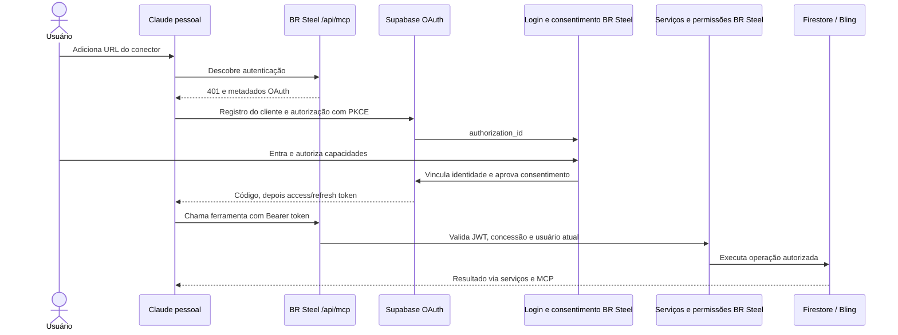

# Conector Claude do BR Steel — arquitetura proposta

Data: 11/09/2026. Status: proposta para revisão; implementação e publicação ainda não executadas.

Objetivo: permitir que cada usuário conecte seu próprio Claude ao BR Steel por OAuth e use ferramentas de leitura e escrita com a sua identidade. Prioridade confirmada: **vendas, estoque e produção**.

## 1. O que foi examinado

Análise estática dos checkouts locais: BR Steel em `412f5e4` e Calculaqui em `9e7d242`. Não foram consultados dados de clientes, segredos ou configurações privadas de produção. O código local demonstra os mecanismos implementados; não comprova quais flags estão habilitadas nos ambientes publicados.

| Referência no Calculaqui | O que existe no código |
| --- | --- |
| `vercel.json` | `/api/mcp` encaminha para uma Supabase Edge Function. |
| `supabase/functions/mcp/index.ts` | HTTP/JSON-RPC, descoberta OAuth, JWT via JWKS, identidade, seleção de empresa, ferramentas e auditoria. |
| `src/pages/OAuthConsentPage.tsx` | Consentimento por `authorization_id`, consulta dos detalhes, aprovação/recusa e retorno ao Claude. |
| `src/auth/oauthConsentSession.ts` | Reutiliza sessão Supabase existente; no modo legado faz a troca de identidade Firebase. |
| `supabase/functions/firebase-exchange/index.ts` e `handler.ts` | Verifica o token Firebase, provisiona/vincula a identidade, gera OTP de sessão e limita requisições. |
| `supabase/migrations/20260624195826_mcp_oauth_phase1.sql` | Hook que acrescenta `firebase_uid` ao token. Há outras migrations posteriores: não aplicar esta isoladamente como receita atual. |
| `supabase/functions/mcp/tools.ts` | Catálogo com 10 ferramentas de leitura e 4 de escrita, incluindo lançamentos, categorias, DFC e projeção. |
| `src/services/mcpConnectionService.ts` | Mostra conexão com base no último uso registrado. |

O fluxo real atual não coincide integralmente com o README inicial. O README fala em federação por `signInWithIdToken`; o caminho legado implementado usa `firebase-exchange` e `verifyOtp`. O runtime também aceita autenticação Supabase nativa. A tela de consentimento ainda descreve somente consultas, embora o servidor contenha escrita condicionada a `MCP_WRITES_ENABLED`.

O servidor valida acesso à empresa e usa o JWT do usuário nas consultas Postgres, onde RLS protege os registros. Usa credencial de serviço para auditoria e status da conexão. As escritas têm prévia com `confirmar`, e criação recorrente exige chave de idempotência. Isso é uma boa referência funcional, mas há pontos a melhorar na adaptação:

- A validação de `aud` depende de uma variável opcional; no BR Steel será obrigatória.
- Um booleano `confirmar=true` não prova que houve uma prévia nem aprovação humana.
- Auditoria e status de conexão são best-effort. Último uso não representa autorização válida ou revogável.
- Idempotência precisa cobrir todas as mutações e concorrência, não apenas uma consulta anterior à gravação.
- O handler implementa JSON-RPC manualmente e devolve a versão pedida pelo cliente. Aqui usaremos o SDK e sua negociação real de versão.

## 2. Diferenças do BR Steel que determinam o projeto

| Área | Estado observado | Consequência |
| --- | --- | --- |
| Login | `src/lib/server-auth.ts`: cookie próprio `brsteel_session`, senha com scrypt, sessão de 8 horas. | Não existe ID token Firebase no fluxo principal que possa ser usado no exchange do Calculaqui. |
| Papéis | `Administrador`, `Vendedor`, `Operador`; permissões por página, configuráveis em `appSettings/general`. | Criar capacidades por operação e cruzá-las com permissões atuais. Acesso à página não deve conceder automaticamente toda escrita. |
| Persistência | Firestore, com Admin SDK em parte das APIs e SDK cliente em serviços legados. | RLS do Supabase não protege Firestore. A autorização deverá ser executada no servidor em cada operação. |
| Regras locais | `legacyClientAccess()` retorna `true`, inclusive em `users` e `appSettings`. | Proteger primeiro as fontes de identidade/permissões e, por módulo, os dados expostos no MCP. Confirmar regras publicadas na implantação. |
| Sessão | Existe fallback fixo para segredo de sessão; papel é copiado para o cookie. | Produção deve exigir segredo configurado e recarregar o usuário atual; remover usuário/trocar papel deve afetar a próxima chamada. |
| Cadastro | Existe senha inicial compartilhada/fallback de senha; `getUsers()` espalha os campos do documento. | Impedir conexão com senha inicial; usar DTO público sem hash/salt e proteger ações administrativas. |
| Vendas | Pedidos do Bling importados em `salesOrders`; leituras e importação já existem. | Primeira escrita de vendas será sincronização/importação local, não criação de pedido fictício só no Firestore. |
| Estoque de produtos | `/estoque` usa `getProductsStock()` em `src/app/actions.ts`, combinando Bling, cache e webhook. | Retornar origem e atualização. Falha externa não pode virar saldo inventado ou zero presumido. |
| Estoque de insumos | `supplies` e `inventoryMovements`, com entrada/saída transacional. | Movimentações locais não alteram automaticamente estoque de produtos no Bling. |
| Produção | Kanban em `productionColumns`, `productionLots`, `productionLotItems`, `productionComments`. | Reutilizar regras de lotes; derivar ator da autenticação e validar itens/pedidos no servidor. |
| Dados simulados | `getProductsStock()` tem fallback aleatório; `getSalesDashboardData()` gera variações aleatórias. | Remover esses resultados do caminho de produção compartilhado antes de usá-lo em ferramentas. |
| MCP existente | `src/services/ml-mcp.ts` é cliente do MCP de documentação do Mercado Livre. | Não é o servidor MCP que os usuários conectarão ao Claude. |

Não foi encontrado um modelo geral de empresas/tenants do BR Steel nos domínios analisados. A primeira versão opera na instalação BR Steel com papéis por usuário. Não copiar `empresa_uid` do Calculaqui sem um modelo de associação real. Contas/lojas externas devem ser selecionadas explicitamente quando houver mais de uma elegível.

## 3. Alternativas e recomendação

| Opção | Vantagens | Custo ou limite |
| --- | --- | --- |
| **A. Supabase OAuth + MCP no Next.js — recomendada** | Reaproveita o modelo de OAuth conhecido; mantém dados e regras junto ao sistema. | Acrescenta um projeto Supabase dedicado à identidade e uma ponte de sessão. |
| B. OAuth e MCP nas Edge Functions, como no Calculaqui | Maior semelhança de hospedagem. | Precisa transportar regras ou chamar uma API do BR Steel; acrescenta um salto e integração de Firestore no runtime Deno. |
| C. Servidor OAuth próprio junto ao Next.js | Dispensa Supabase. | Passamos a manter registro de clientes, códigos, PKCE, rotação, revogação e compatibilidade OAuth. Maior esforço e responsabilidade. |

A proposta A reproduz a experiência do Calculaqui e adapta a hospedagem ao BR Steel. Usar projeto Supabase próprio do BR Steel, separado do Calculaqui. Dados operacionais permanecem no Firestore. Nenhuma migração geral de banco ou de senhas é necessária para esse desenho.

O Claude usa a conta do próprio usuário. O BR Steel oferece ferramentas; este fluxo não precisa chamar a API da Anthropic nem receber uma chave Claude do usuário. Infraestrutura do conector e integrações do sistema continuam sendo responsabilidades do BR Steel.

## 4. Identidade e OAuth

### Contrato de identidade

- Identidade primária do sistema: ID persistente do documento em `users`, sem presumir que seja e-mail ou Firebase UID.
- Identidade externa: `sub` do Supabase, vinculada uma única vez ao ID BR Steel.
- `mcpIdentities/{supabaseSub}`: `userId`, `createdAt`, `disabledAt`.
- Vinculação reversa única em `mcpIdentityBindings/{hash(userId)}` evita múltiplos vínculos concorrentes. Criar ambos na mesma transação Firestore.
- Metadata administrativa `brsteel_user_id` pode ajudar no diagnóstico, mas a vinculação protegida e o usuário atual são a autoridade. Não confiar em metadata editável pelo usuário.

### Fluxo da ponte

1. `/oauth/consent` recebe `authorization_id`. Sem sessão local, redireciona ao login preservando somente um destino interno validado. A troca obrigatória de senha também preserva o retorno.
2. `POST /api/mcp-auth/session` exige sessão local válida, usuário atual habilitado, senha já alterada, Origin/CSRF e autorização OAuth pendente. Não aceita `userId`, papel ou e-mail arbitrários do navegador.
3. Backend provisiona uma identidade Supabase dedicada e vincula o `sub` ao usuário. Em colisão de e-mail/vínculo, recusa: não vincula automaticamente uma conta preexistente apenas por e-mail.
4. Adaptar o padrão `generateLink` + `verifyOtp` do Calculaqui: geração e consumo do segredo temporário no backend, sem envio de e-mail para cada conexão e sem expor OTP ao JavaScript da página. Credencial administrativa só no servidor.
5. A sessão Supabase para consentimento usa cookies próprios HttpOnly, Secure e SameSite=Lax, sem sobrescrever `brsteel_session`. Em cada etapa, conferir que o `sub` corresponde ao usuário local; descartar sessão de outra conta após troca de usuário.
6. `/api/mcp-auth/authorization` consulta os detalhes reais da autorização. Não confiar em nome, `client_id` ou redirect apresentados em campos escondidos do navegador.
7. A página mostra identidade, cliente, destino, operações permitidas e escolhas de leitura/escrita. Backend salva a concessão e chama `approveAuthorization`; se falhar, a concessão não pode ficar ativa por acidente. Recusa chama `denyAuthorization`.
8. Supabase entrega código ao Claude; troca e renovação são responsabilidade do servidor OAuth. O token nunca é colocado na URL MCP.

As APIs `generateLink`, `verifyOtp` e OAuth já são referências disponíveis; a ponte específica da sessão BR Steel deverá ser comprovada em ambiente de teste. Não é uma configuração pronta existente neste repositório.

### Descoberta e tokens

- Endpoint canônico: `APP_ORIGIN + /api/mcp`, definido por configuração validada; não inferido de Host recebido.
- PRM em `/.well-known/oauth-protected-resource/api/mcp`, com `resource` exatamente igual ao endpoint. `401` anuncia essa URL em `WWW-Authenticate`.
- Supabase anuncia seus próprios endpoints de autorização, token, registro e JWKS. Consumir discovery; não copiar URLs antigas do README.
- DCR habilitado para o conector customizado, PKCE S256 e callback exato do Claude hospedado. Claude Code exige teste separado do callback loopback; não assumir compatibilidade automática.
- Hook configura `aud` para a URL MCP apenas em emissões OAuth relevantes e preserva sessões normais. Validar também no refresh. O primeiro teste de integração deve comprovar isso.
- MCP exige assinatura, algoritmo permitido, `iss`, `aud`, `exp`, `sub`, `client_id` e concessão ativa. Não aceitar token de sessão web, API key ou token de Bling como autenticação MCP.
- Access token alvo: 15 minutos. Renovação com rotação no provedor; revogação local é consultada em cada chamada e não depende desse prazo.

A documentação atual suporta OAuth gerenciado com PKCE, DCR e rotação. A validação do recurso é requisito do protocolo, e o Supabase documenta customização de audiência por hook. [MCP Authorization](https://modelcontextprotocol.io/specification/2025-11-25/basic/authorization), [Supabase MCP](https://supabase.com/docs/guides/auth/oauth-server/mcp-authentication), [Token Security](https://supabase.com/docs/guides/auth/oauth-server/token-security).

## 5. Permissões, concessões e revogação

Capacidades iniciais: `vendas:read`, `vendas:sync`, `estoque:read`, `insumos:read`, `insumos:write`, `producao:read`, `producao:write`.

Essas são capacidades do BR Steel, persistidas na concessão. O Supabase documenta apenas escopos OIDC padronizados e ainda não suporta escopos customizados. O consentimento de capacidades é aplicado pelo backend, inclusive quando o consentimento OAuth já havia sido concedido. [Fluxos OAuth do Supabase](https://supabase.com/docs/guides/auth/oauth-server/oauth-flows).

| Capacidade | Página-base | Papéis padrão propostos |
| --- | --- | --- |
| `vendas:read` | `/vendas` | Administrador, Vendedor |
| `vendas:sync` | `/vendas` | Administrador, Vendedor |
| `estoque:read` | `/estoque` | Administrador, Vendedor, Operador |
| `insumos:read`, `insumos:write` | `/insumos` | Administrador, Operador |
| `producao:read`, `producao:write` | `/producao` ou `/producao/kanban`, conforme ferramenta | Administrador, Operador |

Na execução, a permissão efetiva é a interseção de: usuário habilitado + página ativa + papel permitido pela configuração atual + capacidade concedida + flags da ferramenta. Papéis de escrita acima são a proposta inicial, não uma política já existente no sistema.

Produção precisa consultar itens de pedidos sem conceder ao Operador todo o financeiro de vendas. Serviço de produção terá uma projeção restrita de pedido: ID, número, SKU, descrição, quantidade e identificação operacional necessária; sem valores de venda ou documentos pessoais desnecessários.

`mcpConnections/{hash(sub,clientId)}` guarda usuário, cliente, capacidades, status, `approvedAt`, `validAfter`, `lastSeenAt`, `revokedAt`. Cada reautorização atualiza `validAfter`; tokens emitidos antes dessa geração são recusados. Validar precisão temporal e renovação no teste OAuth. A concessão local bloqueia tokens antigos mesmo que o provedor ainda aceite sua assinatura.

Revogação: primeiro desativar concessão local, depois revogar o grant no provedor. Se o provedor falhar, registrar pendência de tentativa; o acesso local já estará bloqueado. Não reativar a mesma concessão antes de confirmar a revogação dos refresh tokens anteriores: um refresh antigo não pode obter novo `iat` e contornar `validAfter`. Remoção/desativação do usuário ou mudança de papel afeta a próxima chamada. A conexão é por usuário+cliente, e a interface deve deixar essa abrangência explícita. O provedor documenta invalidação de sessões e refresh tokens por `revokeGrant`; validar isso no ambiente de teste. [Revogação Supabase](https://supabase.com/docs/reference/javascript/oauth-server-revokegrant).

## 6. Catálogo inicial

Todos os argumentos usam schemas estritos; usuário, papel e autoria vêm do contexto autenticado. Consultas paginadas usam limite padrão 50 e máximo 100. Datas civis em `America/Sao_Paulo`, timestamps em ISO UTC. Nenhuma ferramenta aceita caminho livre de coleção, SQL, URL arbitrária ou credencial.

| Ferramenta | Operação e fonte | Capacidade |
| --- | --- | --- |
| `consultar_meu_acesso` | Nome, capacidades e módulos acessíveis; sem credenciais. | Usuário/concessão válidos |
| `listar_pedidos` | Pedidos importados, por período, loja e situação, com cursor. | `vendas:read` |
| `consultar_pedido` | Detalhes comerciais mínimos de um pedido existente. | `vendas:read` |
| `resumir_vendas` | Totais reais do período e comparação calculada com período anterior equivalente. | `vendas:read` |
| `sincronizar_pedidos` | Busca no Bling e grava importação no BR Steel; período máximo inicial de 7 dias por operação. | `vendas:sync` |
| `consultar_estoque_produtos` | Saldo físico/virtual e origem por SKU; Bling/cache/webhook. | `estoque:read` |
| `listar_insumos` | Cadastro, mínimos/máximos e saldo local. | `insumos:read` |
| `listar_movimentacoes_insumo` | Histórico local por insumo/período. | `insumos:read` |
| `registrar_movimentacao_insumo` | Entrada/saída local, quantidade positiva, motivo e saldo resultante. | `insumos:write` |
| `atualizar_limites_estoque` | Mínimo/máximo local de SKU já cadastrado; mínimo ≤ máximo. | `insumos:write` |
| `consultar_demanda_producao` | Demanda a partir de pedidos e estoque reais, com alertas de dados indisponíveis. | `producao:read` |
| `listar_pedidos_para_producao` | Projeção operacional de itens para composição de lote. | `producao:read` |
| `listar_colunas_producao`, `listar_lotes_producao`, `consultar_lote_producao` | Colunas, lotes e itens. | `producao:read` |
| `criar_lote_producao` | Vincula itens reais de pedidos; valida referências e gera número sem colisão. | `producao:write` |
| `atualizar_lote_producao` | Título, prazo, prioridade e responsável elegível, com versão esperada. | `producao:write` |
| `mover_lote_producao` | Muda coluna com controle de concorrência; não altera situação no Bling. | `producao:write` |

Vendas tem escrita de importação local nesta entrega. Criar/editar/cancelar pedidos no Bling, alterar saldo de produtos no ERP, publicar mudanças no Mercado Livre, excluir lotes e operar financeiro são expansões separadas. Evita-se criar um estado local que contradiga o ERP.

## 7. Execução de escrita

1. Chamada inicial da ferramenta retorna prévia, impacto, versão dos registros e `operation_id`, sem mudar dados de negócio.
2. Prévia persiste por 10 minutos, vinculada a usuário, cliente, capacidade e hash dos argumentos. Ao confirmar, o servidor consome os argumentos armazenados; rejeita mudanças de payload.
3. Interface do Claude pode pedir aprovação da ferramenta. Isso não prova aprovação humana no BR Steel. Para mutações operacionais rotineiras, consentimento de escrita + prévia vinculada + chamada de confirmação é o mecanismo proposto. Uma futura operação de maior impacto pode exigir aprovação na interface BR Steel.
4. Confirmação exige `operation_id` e `idempotency_key`, checa novamente concessão, papel, flag e versões dos registros.
5. Mutações Firestore, registro de idempotência e evento de sucesso são atômicos. Retry com mesma chave e payload retorna o resultado anterior; mesma chave com payload diferente retorna conflito. Dois pedidos simultâneos não duplicam a alteração.
6. Manter a regra atual de estoque local que admite saldo negativo, mostrando alerta explícito na prévia e resultado. Quantidade da movimentação é sempre finita e positiva. Não introduzir bloqueio silencioso diferente da interface.
7. Sincronização usa `mcpOperations` como trabalho durável, com checkpoint de página e importação idempotente por pedido. Repetir solicitação retorna a mesma operação. Nunca depender de uma Promise em memória após resposta serverless.
8. `consultar_operacao` permite ao proprietário acompanhar status, contagem e falha parcial. Não confundir trabalho aceito com importação concluída. Execução longa usa worker/cron autenticado e leasing durável; nenhum POST de cliente pode se passar pelo worker.

Transições de lote não devem consumir estoque implicitamente, porque esse vínculo não está implementado no serviço atual. Qualquer automação desse tipo exige regra de negócio própria.

## 8. Camada de serviços e dados confiáveis

Separar regras/repositórios em `src/server/operations/`, marcados `server-only`. API web, Server Actions e MCP chamam a mesma camada com um contexto explícito. `use server` sozinho não autoriza uma ação.

Extrair apenas os trechos necessários de `src/app/actions.ts`, `order-service.ts`, `inventory-service.ts`, `supply-service.ts` e `kanban-service.ts`. Não importar cegamente o arquivo inteiro de ações como catálogo de ferramentas.

Preservar fontes: produtos/Bling, insumos/Firestore e lotes/Firestore. Retorno inclui `source`, `asOf`, `warnings` e `nextCursor` quando aplicável. Se a origem não fornecer timestamp, usar instante da consulta e indicar que a atualização original é desconhecida. Zero real deve continuar zero, sem fallback com `||` que o substitua por outro saldo. Não usar saldo simulado para sugerir produção.

Vendas e Kanban usam `onSnapshot` direto hoje. Ao fechar coleções, substituir esses consumidores por APIs autenticadas com atualização periódica de 10 segundos enquanto a página estiver visível, além de atualização imediata após mutações. Documentar a alteração de atualização visual; não fechar regras antes de substituir todos os consumidores necessários.

## 9. Auditoria, limites e operação

- `mcpAuditLogs`: request/operation ID, usuário, cliente, ferramenta, entidade, resultado, duração, hash dos argumentos e diferenças mínimas relevantes. Nunca tokens, senhas ou cópia integral de pedidos.
- `mcpIdempotency`, `mcpOperations`, `mcpConnections`, `mcpIdentities`, `mcpIdentityBindings`: acesso direto do navegador negado; leitura de status por APIs com autorização.
- Registro de sucesso de escrita na mesma transação dos dados locais. Falha de auditoria não pode resultar em escrita silenciosa. Falhas de leitura geram telemetria sem vazar erro interno.
- Flags `MCP_ENABLED=false` e `MCP_WRITES_ENABLED=false` por padrão; ativação por lista de usuários no piloto.
- Limites iniciais propostos: 60 leituras e 10 confirmações de escrita por minuto por usuário+cliente; 2 sincronizações concorrentes por instalação. Estado compartilhado/durável; retornar 429 e Retry-After.
- Definir retenção operacional inicial de 90 dias para auditoria e 24 horas para chaves de idempotência, com limpeza por TTL. Retenção jurídica não foi avaliada; não é política contábil.
- Sem cache público de respostas autenticadas; limite de corpo 64 KiB para ferramentas e de saída 256 KiB, com paginação. Entradas rejeitadas antes de operações de banco.
- Rollback desliga `MCP_ENABLED`/`MCP_WRITES_ENABLED` e concessões. Preserva dados e histórico; não reabre regras Firestore.

## 10. Critérios de aceite

- Usuário conecta pelo Claude hospedado, faz login, consente, lista ferramentas e conclui uma leitura e uma escrita autorizada.
- Senha inicial, sessão de outro usuário, CSRF, concessão revogada, papel removido, usuário desativado e token com audiência errada são recusados.
- Operador recebe projeção de produção, não campos financeiros de vendas; Vendedor não ganha produção por ter acesso ao estoque.
- Coleções de identidade/permissões e dos módulos liberados não aceitam acesso anônimo nem alterações por ações web desprotegidas.
- Prévia não grava negócio; confirmação expirada ou com registros alterados exige nova prévia.
- Retry/concorrência gera uma única mutação, incluindo autor e auditoria corretos.
- Números apresentados pelo Claude correspondem às mesmas consultas da interface; simulação nunca aparece como dado real.
- Revogação funciona na próxima chamada e tokens anteriores não voltam a funcionar depois da reconexão.
- Login, troca de senha, gestão de usuários, vendas, insumos e Kanban continuam funcionais após a migração dos acessos.

## 11. Referências externas verificadas

- [Autenticação de conectores Claude](https://claude.com/docs/connectors/building/authentication): PKCE S256, DCR/CIMD, metadados, callbacks e renovação. Adotar DCR inicialmente; suporte a Code é uma verificação separada.
- [Conectores customizados no Claude](https://support.claude.com/en/articles/11175166-get-started-with-custom-connectors-using-remote-mcp): conexão individual por OAuth e endpoint acessível pela infraestrutura Anthropic.
- [Supabase — criação do consentimento](https://supabase.com/docs/guides/auth/oauth-server/getting-started): API de detalhes/aprovação/recusa e uso de `redirect_url`.
- [Supabase — generateLink](https://supabase.com/docs/reference/javascript/auth-admin-generatelink): mecanismo administrativo usado como referência da ponte.
- [Node.js 20 descontinuado nos clientes Supabase](https://supabase.com/changelog/45715-deprecation-notice-dropping-support-for-node-js-20): adotar Node.js 22+; ambiente local observado: 22.19.0.
- [Status HTTP do token OAuth](https://supabase.com/changelog/45468-breaking-change-oauth-token-endpoint-will-return-http-200-instead-of-201): tratar sucesso 2xx, não exigir 201.

Próximo passo de engenharia: executar o plano associado após revisão desta proposta, começando pela proteção da identidade e pela prova OAuth em ambiente de teste.
